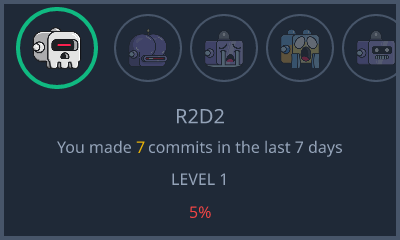

## WALLE
A dynamic image in readMe powered by vercel-og and Githup api, which shows me weekly updates of my coding activities on github.

### How it works
-Walle has various stages and healths. The more i commit code, the more it increasing in health and  evolves to a higher level. And when i commit less/no code, its health reduces and eventually reverts back to the previous stage.

### Behind the scenes
-I have nodejs script that fetches commits from last 1 week from the github API(excluding github action commits) and updates the health and current level based on that. This script then runs every 7 days using github action.

-To generate the image, i have a template built with tailwindcss in a nextjs API route that uses vercel-og to generate the image..and i simply just use query params to pass the current level, health and commits and get back the corresponding image

    
